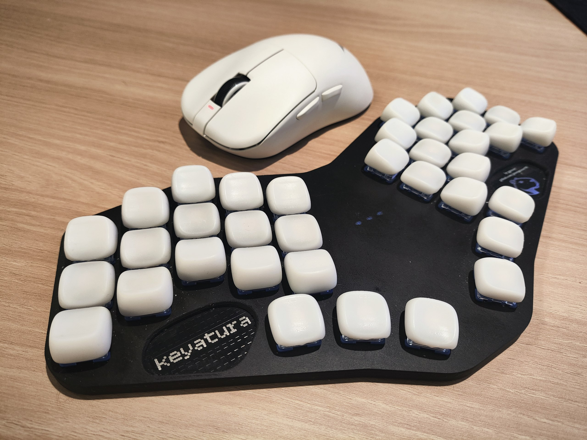

# KEYATURA + LARISKA

ZMK config for [keyatura](https://github.com/greengrocer98/keyatura) as central and [lariska](https://github.com/greengrocer98/lariska) as peripheral with [esb](https://github.com/badjeff/zmk-feature-split-esb) support.

## Features
1. 1000 Hz mouse polling rate with esb
2. all zmk features for split keyboards
3. [LED module](https://github.com/greengrocer98/zmk-vfx-rgbled-indicator) for mouse with battery and cpi indication
